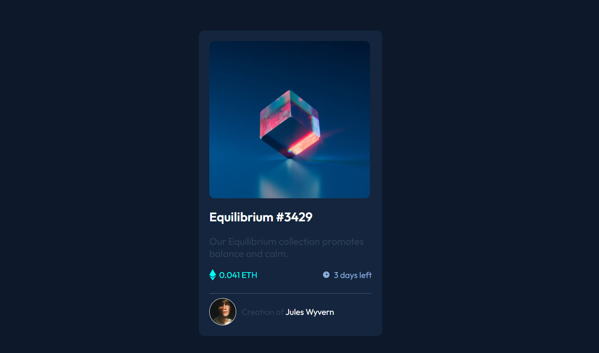

# Frontend Mentor - NFT preview card component solution

This is a solution to the [NFT preview card component challenge on Frontend Mentor](https://www.frontendmentor.io/challenges/nft-preview-card-component-SbdUL_w0U). Frontend Mentor challenges help you improve your coding skills by building realistic projects. 

## Table of contents

- [Overview](#overview)
  - [Screenshot](#screenshot)
  - [Links](#links)
- [My process](#my-process)
  - [Built with](#built-with)
- [Author](#author)

## Overview
This is my second Frontend Mentor project. A simple card component which contain a QR Code, title and a description. I have used HTML5 and CSS3 to build this project.

### Screenshot

### Links

- Live Site URL: [https://siddhinandaniya.github.io/NFT-Preview-card/](https://siddhinandaniya.github.io/NFT-Preview-card/)
- Solution URL: [https://www.frontendmentor.io/solutions/nftpreviewcard-using-html5-and-css3-AmY9EuZiz](https://www.frontendmentor.io/solutions/nftpreviewcard-using-html5-and-css3-AmY9EuZiz)

## My process

- First developed html body structure
- Started building with mobile first approach
- Used flexbox for alignment

### Built with

- Semantic HTML5 markup
- CSS
- Flexbox
- Mobile-first workflow

## Author

- Linkedin - [Siddhi Nandaniya](https://www.linkedin.com/in/siddhi-nandaniya/)
- Frontend Mentor - [@siddhinandaniya](https://www.frontendmentor.io/profile/Siddhinandaniya)
